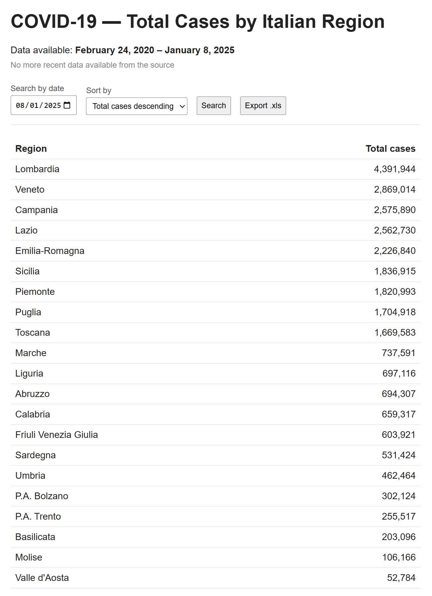
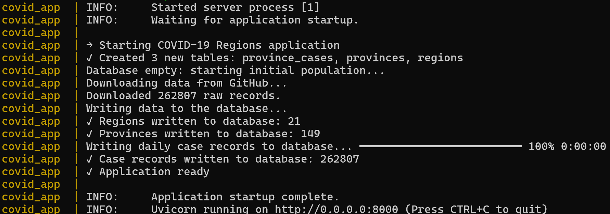

# COVID-19 Cases by Italian Region

A web application that reads the per-province COVID-19 dataset published by the Italian Civil Protection Department ([pcm-dpc/COVID-19](https://github.com/pcm-dpc/COVID-19)), stores it in a PostgreSQL database, and shows the total number of cases aggregated by region, searchable by date, sortable, and exportable to `.xls`.

📄 For a more detailed discussion of the technical decisions behind the project, including data analysis, database design, application architecture, security, ingestion logic, and testing strategy, see [`technical-notes.md`](technical-notes.md).


<p align="center">
  
  <br>
  <em>Main application page</em>
</p>


## Features

- **Regional overview**: the main page shows total COVID-19 cases aggregated by region for the current day, sorted from the highest to the lowest, with region name as an alphabetical tiebreaker.
- **Search by date**: look up any day between 24/02/2020 and today.
- **Sortable results**: change the sort order (total cases or region name, ascending or descending) directly from the browser.
- **Export to .xls**: download the exact data currently shown on the page as a two-column Excel spreadsheet.

Date and sort order are both optional and independent: pick a date, a sort order, or both, then click **Search** to apply them.
The export always reflects the currently displayed results. If you change the date or sort order, click **Search** first to apply the new selection, then use **Export .xls** to download the corresponding data.

**Note on the data source:** the source repository stopped publishing new data on 08/01/2025. The application detects this automatically at startup (checking for updates without re-downloading the full dataset) and, when "today" has no data, falls back to the most recent available date, stating this explicitly on the page rather than silently showing stale data as current.

## Tech stack

**Python 3.12**: application language  
**FastAPI** + **Uvicorn**: web framework and ASGI server  
**PostgreSQL 16** + **SQLAlchemy** + **psycopg**: database, ORM, and PostgreSQL driver  
**Pydantic Settings**: environment-based application configuration  
**Jinja2**: server-side HTML templates (no frontend framework: the app is a single page with a form and a table, which doesn't warrant one)  
**xlwt**: generates real legacy `.xls` files, not `.xlsx`  
**httpx**: downloads the dataset from GitHub  
**rich**: readable, color-coded console output during startup and data ingestion  
**pytest**: automated test suite  
**Docker**: containerized database and application

## Getting started

Requires [Docker](https://www.docker.com/) with Docker Compose; no local Python installation is needed.

```bash
git clone <this-repository-url>
cd <repository-folder>
cp .env.example .env
docker compose up --build
```

Open [http://localhost:8000](http://localhost:8000). On first run, the application creates the database schema and downloads the full historical dataset (~110 MB) automatically. This takes a few seconds. Subsequent runs skip this step, checking for new data with a much smaller request instead.

<p align="center">
  
  <br>
  <em>Application startup and data ingestion log</em>
</p>

## Running the tests
Tests run against a temporary SQLite database with fixed sample data, no network access or running Postgres instance required.

```bash
python -m venv .venv
.venv\Scripts\activate        # Windows
pip install -r requirements-dev.txt
pytest tests/ -v
```

25 tests cover aggregation and sorting logic, date/sort parameter validation, the `.xls` export, full HTTP routes, and security checks (SQL injection attempts, XSS payloads, and consistency between the page and the export for identical parameters).


## Project structure

```
app/
├── main.py                   # FastAPI app, startup lifecycle, routes, error handlers
├── config.py                 # Environment-based configuration
├── database.py               # SQLAlchemy engine/session setup
├── models.py                 # ORM models: Region, Province, ProvinceCase
├── repository.py             # Aggregation queries, sorting, date resolution
├── services/
│   ├── ingestion.py          # Download, validate, and load data from GitHub
│   └── export.py             # .xls file generation
└── templates/
    ├── index.html             # Main page
    ├── error_404.html         # Custom 404 page
    ├── error_500.html         # Custom 500 page
    └── error_503.html         # Custom 503 page (database unreachable)

tests/
├── conftest.py               # Shared fixtures and temporary SQLite test database
├── test_repository.py        # Aggregation, sorting, and date resolution tests
├── test_routes.py            # HTTP route and security tests
└── test_export.py            # .xls generation tests

docker-compose.yml             # PostgreSQL + application services
Dockerfile                     # Application image
requirements.txt               # Runtime dependencies
requirements-dev.txt           # Development/test dependencies
.env.example                   # Example environment configuration
technical-notes.md             # Detailed technical decisions and implementation notes
README.md                      # Project documentation
```
