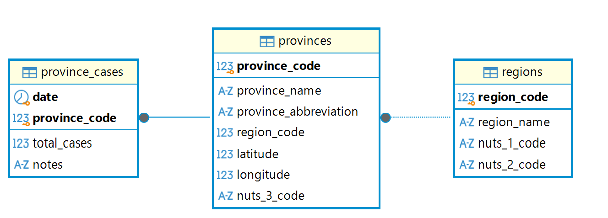

# Technical Decisions

A web application that reads COVID-19 case data published by the Italian Civil Protection Department, stores it in PostgreSQL, and shows total cases by region — searchable, sortable, and exportable to `.xls`.

## Contents

1. [Understanding the data](#1-understanding-the-data)
2. [Database](#2-database)
3. [Application](#3-application)
4. [Security](#4-security)
5. [Testing](#5-testing)
6. [AI assistance](#6-ai-assistance)

---

## 1. Understanding the data

Before writing any code, the source dataset was analysed directly. Several of its characteristics turned out to have a direct impact on the schema design — two of them would have caused silent, hard-to-spot bugs if discovered later.

The application uses two official files published by the Italian Civil Protection Department:

- [`dpc-covid19-ita-province.json`](https://github.com/pcm-dpc/COVID-19/blob/master/dati-json/dpc-covid19-ita-province.json): the complete historical province-level dataset, used for the initial load and for full updates.
- [`dpc-covid19-ita-province-latest.json`](https://github.com/pcm-dpc/COVID-19/blob/master/dati-json/dpc-covid19-ita-province-latest.json): the much smaller file containing only the most recent published day, used at startup to check whether the local database is already up to date before deciding whether the full dataset needs to be downloaded again.

The analysis below refers to the full historical dataset.

### 1.1 Province-level fields

The official Civil Protection [dataset documentation](https://github.com/pcm-dpc/COVID-19/blob/master/dati-andamento-covid19-italia.md#dati-per-provincia) describes the province-level records with the following fields:

| Field | Meaning |
|---|---|
| `data` | Date and time of the notification, expressed in Italian local time using ISO 8601 format. |
| `stato` | Country of reference, represented by its ISO 3166-1 alpha-3 code (`ITA`). |
| `codice_regione` | ISTAT code of the region. |
| `denominazione_regione` | Name of the region. |
| `codice_provincia` | ISTAT code of the province. |
| `denominazione_provincia` | Name of the province. |
| `sigla_provincia` | Province abbreviation. |
| `lat` | Province latitude in WGS84 coordinates. |
| `long` | Province longitude in WGS84 coordinates. |
| `totale_casi` | Total number of positive cases recorded for the province. |
| `note` | Optional notes in Italian. |

The same official documentation also explains the two special province entries published for each region: **“Fuori Regione / Provincia Autonoma”** (`879–899`) for cases associated with people outside the region or autonomous province, and **“In fase di definizione/aggiornamento”** (`979–999`) for cases not yet assigned to a province. These entries are discussed in more detail below because they directly affect validation and regional aggregation.

| Property | Value |
|---|---|
| Total records | 262,807 |
| Distinct dates | 1,781 (24/02/2020 – 08/01/2025, no gaps) |
| Distinct regions | 21 |
| Distinct province codes | 149 |

**The 149 "provinces" are not 149 provinces.** Italy has 107 provinces, but the dataset contains 149 distinct province codes. The extra 42 are placeholder entries the source publishes for each region, documented in the official data notes:

| Kind | Count | Code range |
|---|---|---|
| Real provinces | 107 | 1–111 |
| "Out of region / autonomous province" | 21 | 879–899 |
| "Under definition / update" | 21 | 979–999 |

These placeholders carry real case counts (cases not yet attributed to a specific province, or belonging to people from another region), so they **must** be included in regional totals. They have `NULL` for abbreviation, latitude and longitude — so validation can't simply reject rows with missing geographic data. The documented ranges were verified against the actual data and matched exactly; they're now used as a validation rule during ingestion.

**The number of provinces per day is not constant.** The "out of region" placeholders only appear from 25/06/2020 onward. Before that date, each day has 128 rows (107 + 21); after it, 149. Any validation assuming a fixed row count would fail across the first four months of the pandemic.

**Timestamps are not consistent.** The `data` field is a full timestamp, but the time component varies: `17:00:00` on 261,527 rows and `18:00:00` on 1,280. The application works at day granularity, so treating the full timestamp as the date key would be both unnecessary and error-prone. Ingestion therefore truncates it to date only.

**`totale_casi` is cumulative, not daily.** Each value represents the total number of cases recorded for that province up to that date, not the number of new cases reported on that day. Regional totals must therefore be calculated by summing provinces within a single date; summing values across dates would count the same cases repeatedly.

**Cross-validation against a separate official dataset.** As a final check, the aggregation produced by this application (summing province-level values) was compared against the pre-aggregated regional file published by the same source. All 21 regions matched exactly — confirming both the aggregation logic and, separately, the region code normalization described below.

---

## 2. Database

### 2.1 Why relational

The core operation is `SUM(cases), GROUP BY region, ORDER BY` — a natural fit for a relational database. The source data has a fixed, well-defined schema and clear relationships between regions, provinces, and daily case records. The write workload is batch-oriented — an initial bulk load followed only by occasional updates — while the application is primarily read-oriented. A document store would add complexity without addressing any requirement that the relational model does not already handle directly.

### 2.2 Why separate tables

The database is split into three tables because the source contains three different kinds of information with different lifecycles: regions, provinces, and case values that change every day. Keeping all of them in a single flat table would repeat the same geographic metadata for every daily record.

With the normalized design:

- `regions` stores each region once, together with attributes that belong to the region itself, such as its name and NUTS codes.
- `provinces` stores each province — including the placeholder province entries published by the source — once, and links it to its region through `region_code`.
- `province_cases` stores only the values that actually vary over time: the date, province, cumulative case count, and optional notes.

This mirrors the real relationships in the data: **one region has many provinces, and one province has many daily case records**. The foreign keys make those relationships explicit and prevent a case row from referring to a province that does not exist, or a province from referring to an unknown region.

The main advantage over a single table is therefore **data integrity and reduced duplication**. In a flat design, values such as the region name, province name, abbreviation, coordinates, and NUTS codes would be repeated across thousands of daily rows even though they describe the same geographic entity. Besides wasting space, this creates update and consistency problems: if the same region or province were stored with two different names or attributes, both versions could coexist silently and affect grouping or later queries. In the normalized schema there is one authoritative row for each region and province, so their descriptive data is stored in one place.

The separation also matches how ingestion works. Records are first normalized into unique regions and provinces, then daily case rows are loaded afterwards. The database is populated in the same dependency order enforced by the foreign keys: `regions` → `provinces` → `province_cases`. Re-running ingestion does not create duplicate rows because the natural primary keys identify the same entities and daily records consistently.

This design does require joins when calculating regional totals, but those joins are simple and follow primary/foreign-key relationships. For this application that trade-off is preferable to duplicating geographic information throughout the fact data: the schema remains compact, consistent, and closely aligned with the structure of the source.

### 2.3 Database schema

The ORM models correspond to the following simplified SQL schema:

```sql
CREATE TABLE regions (
    region_code    INTEGER PRIMARY KEY,
    region_name    TEXT NOT NULL UNIQUE,
    nuts_1_code    TEXT,
    nuts_2_code    TEXT
);

CREATE TABLE provinces (
    province_code          INTEGER PRIMARY KEY,
    province_name          TEXT NOT NULL,
    province_abbreviation  TEXT,
    region_code            INTEGER NOT NULL REFERENCES regions(region_code),
    latitude               REAL,
    longitude              REAL,
    nuts_3_code            TEXT
);

CREATE TABLE province_cases (
    date              DATE    NOT NULL,
    province_code     INTEGER NOT NULL REFERENCES provinces(province_code),
    total_cases       INTEGER NOT NULL CHECK (total_cases >= 0),
    notes             TEXT,
    PRIMARY KEY (date, province_code)
);
```

<p align="center">
  
  <br>
  <em>Database schema and relationships</em>
</p>

**Natural keys, not surrogate ids.** Both `region_code` (after normalization, see [2.4](#24-the-region-code-problem-and-how-ingestion-resolves-it)) and `province_code` were verified to be stable and unique across the full dataset. Since the source already provides reliable identifiers for both entities, introducing additional surrogate IDs would add no practical benefit.

**Composite primary key on the fact table.** `(date, province_code)` is the natural key of `province_cases`: for a given day, each province has at most one case record. The combination was verified to contain no duplicates across the dataset. It also prevents duplicate inserts at database level and supports ingestion through `ON CONFLICT DO NOTHING`.

### 2.4 The region code problem, and how ingestion resolves it

The two autonomous provinces of Bolzano and Trento are treated as separate regions by the source (which is why there are 21 "regions" rather than 20), but their region code is not stable across the source's own files:

| File | Bolzano | Trento |
|---|---|---|
| Per-province file, until 24/06/2020 | `21` | `22` |
| Per-province file, from 25/06/2020 | `4` | `4` |
| Official regional file, entire series | `21` | `22` |

From 25/06/2020 the per-province file switches to `4` — the ISTAT code for Trentino-Alto Adige — for **both**. That single code maps to two distinct entities, so it cannot serve as a key: aggregating by region code as-is would silently merge Bolzano and Trento from mid-2020 onward.

The regional file keeps `21`/`22` for the entire series and never uses `4`, so those codes are adopted as canonical. Ingestion normalizes the per-province values using the region *name* — which is stable throughout — to disambiguate:

```python
REGION_CODE_OVERRIDES = {"P.A. Bolzano": 21, "P.A. Trento": 22}

def _normalize_region_code(region_code: int, region_name: str) -> int:
    return REGION_CODE_OVERRIDES.get(region_name, region_code)
```

Every other region's code passes through unchanged. This runs once, in one place, before any row reaches the database — so the ambiguity never propagates any further than the ingestion function itself.

---

## 3. Application

### 3.1 Packages and languages used

- **Python 3.12** — application language.
- **FastAPI** + **Uvicorn** — web framework and ASGI server. FastAPI provides typed route definitions, request handling, and automatically generated OpenAPI documentation at `/docs`; Uvicorn runs the ASGI application.
- **PostgreSQL 16** + **SQLAlchemy** + **psycopg** — database, ORM/query layer, and PostgreSQL driver. PostgreSQL was chosen as a production-representative relational database; SQLAlchemy keeps database access expressed through Python objects and bound values rather than hand-built SQL strings.
- **Pydantic Settings** — typed, environment-based application configuration. Database settings are read from environment variables (and `.env` for local use), while Docker Compose overrides the host so the application can reach the `db` service by name.
- **Jinja2** — server-side HTML templates. No frontend framework is used: the application is a single page with a form and a table, and its state is represented by URL query parameters, so a client-side framework would add complexity without solving a real requirement.
- **xlwt** — generates genuine legacy `.xls` files.
- **httpx** — downloads both the full historical dataset and the small `latest` file used for update checks.
- **rich** — readable, colour-coded console output during startup and data ingestion.
- **pytest** — automated test suite.
- **Docker** / **Docker Compose** — containerized application and PostgreSQL database, including service networking, persistent database storage, health checks, and startup dependency management.

### 3.2 Web application structure

The application exposes two `GET` routes, both accepting the same optional `date` and `sort` query parameters:

| Route | Returns |
|---|---|
| `/?date=…&sort=…` | The HTML page |
| `/export?date=…&sort=…` | The `.xls` file |

Both routes delegate date resolution, validation, fallback behaviour, sorting, and the regional aggregation query to the shared `resolve_target_date()` function. Keeping that logic in one place helps keep the page and the export consistent for the same resolved parameters, rather than maintaining two separate implementations.

The application is stateless: there is no session or server-side memory of the user's current selection. The selected date and sort order live in the URL. After the page has been rendered, the export link is built with the resolved `shown_date_iso` and `sort_order`, so `/export` receives the same resolved parameters as the currently displayed page.

Each request opens a short-lived SQLAlchemy session, executes the required queries, and closes the session afterwards. No query result is kept in application memory between requests.

### 3.3 File overview

```
app/
├── main.py                   # FastAPI app, startup lifecycle, routes, error handlers
├── config.py                 # Environment-based configuration
├── database.py               # SQLAlchemy engine/session setup
├── models.py                 # ORM models: Region, Province, ProvinceCase
├── repository.py             # Aggregation queries, sorting, date resolution
├── services/
│   ├── ingestion.py          # Download, validate, and load data from GitHub
│   └── export.py             # .xls file generation
└── templates/
    ├── index.html             # Main page
    ├── error_404.html         # Custom 404 page
    ├── error_500.html         # Custom 500 page
    └── error_503.html         # Custom 503 page (database unreachable)

tests/
├── conftest.py               # Shared fixtures and temporary SQLite test database
├── test_repository.py        # Aggregation, sorting, and date resolution tests
├── test_routes.py            # HTTP route and security tests
└── test_export.py            # .xls generation tests

docker-compose.yml             # PostgreSQL + application services
Dockerfile                     # Application image
requirements.txt               # Runtime dependencies
requirements-dev.txt           # Development/test dependencies
.env.example                   # Example environment configuration
technical-notes.md             # Detailed technical decisions and implementation notes
README.md                      # Project documentation
```

The application code is deliberately split by responsibility: `main.py` wires together the web layer and lifecycle, `repository.py` contains the read/query logic, and the `services` package contains ingestion and export operations. Configuration, database setup, ORM models, templates, tests, and deployment files remain separate from those concerns.

### 3.4 Startup and data population logic

The following sequence runs once per application startup inside FastAPI's lifespan handler, never on individual requests:

```
1. Wait for the database (retries with a bounded timeout)
   ↓
2. Create any missing tables
   ↓
3. Is province_cases empty?
   ├── YES → download the full dataset from GitHub, validate/normalize it, and load it
   └── NO  → download only the small "latest" file from GitHub and compare dates
             ├── newer data available → download the full dataset and ingest it
             └── already current, or update check failed → keep existing data
   ↓
4. Server starts accepting requests
```

Re-downloading roughly 109 MB on every startup just to discover whether anything changed would be wasteful. The source also publishes a much smaller file containing only the latest day, so `check_for_updates()` compares that date with `MAX(province_cases.date)` before deciding whether a full download is necessary.

When a full ingestion is required, `run_ingestion()` follows one pipeline: download → validation and normalization → database load. Regions are written before provinces, and provinces before case records, so foreign-key dependencies are satisfied. Case records are inserted in batches of 5,000, while conflict-safe inserts prevent duplicate rows when already-present data is encountered.

### 3.5 How each feature works

**Regional overview and sorting.** The main query performs the aggregation in PostgreSQL rather than loading all province rows into Python:

```python
select(Region.region_name, func.sum(ProvinceCase.total_cases).label("total"))
    .join(Province, Province.region_code == Region.region_code)
    .join(ProvinceCase, ProvinceCase.province_code == Province.province_code)
    .where(ProvinceCase.date == target_date)
    .group_by(Region.region_code, Region.region_name)
    .order_by(*order_by)
```

As established in [1](#1-understanding-the-data), `total_cases` is cumulative. The query therefore filters to one date first and sums the province values within each region; it never sums the same province across multiple dates. The default order is total cases descending, with region name ascending as the alphabetical tiebreaker required by the task.

The requested sort order is represented by a closed `SortOrder` enum with four allowed values (`cases_desc`, `cases_asc`, `name_asc`, `name_desc`). The repository maps those values to predefined SQLAlchemy `ORDER BY` expressions rather than constructing SQL from the raw query parameter.

**Date search.** `resolve_target_date()` reads the earliest and latest dates stored in the database and parses an explicitly requested date with `datetime.date.fromisoformat()`. Malformed dates and dates outside the available range produce a clear message and fall back to the most recent available date instead of leaving the page empty. The browser's date-picker limits are only a convenience; the server performs the actual validation.

With no explicit date, the application starts from today's date. Because the source stopped publishing on 08/01/2025, the application falls back to the most recent available date when no data exists for today and displays that fact explicitly. A valid historical date requested by the user is shown directly without that fallback notice.

**Export.** The page builds the export link with its currently resolved date and sort order. `/export` then calls the same `resolve_target_date()` used by the HTML route and passes the resulting rows to `generate_xls()`. The exporter writes two columns (`Region`, `Total cases`) to a single worksheet with `xlwt` and returns the workbook bytes as an `application/vnd.ms-excel` attachment whose filename includes the resolved date.

---

## 4. Security

### 4.1 Handling an unreachable database and GitHub rate limiting

Three distinct failure scenarios are handled, each verified by actually triggering it:

**Database unreachable at startup.** `wait_for_database()` retries the connection (3 attempts, 3-second timeout each) before giving up. The timeout is explicit and deliberate: without one, an unreachable database fails according to the operating system's own default TCP timeout, which varies enough between Windows and Linux to make the application appear frozen rather than waiting — discovered directly while testing on both platforms. If every attempt fails, the process terminates cleanly (`os._exit`) with a clear console message, rather than letting Uvicorn print a raw internal traceback on top of it.

**Database becomes unreachable while the app is already running** (e.g. the database container is stopped mid-session, tested directly with `docker compose stop db`). A dedicated exception handler for `OperationalError` returns a `503 Service Unavailable` with a specific page, distinct from a generic error — this is an infrastructure condition, not a bug in the application. Verified: the very next request, once the database is reachable again, succeeds normally with no restart needed.

**GitHub rate-limits the update check.** `check_for_updates()` makes a request to GitHub on every startup where data already exists. This call is wrapped so that any network failure — rate limiting, timeout, GitHub being unreachable — is caught, logged, and treated as "no update available" rather than allowed to crash the startup. This was found directly during development: the unprotected version, hit with a real `429 Too Many Requests` after many rapid restarts while testing, crashed the whole application on startup, which combined with the container's automatic restart policy produced a crash loop that kept re-triggering the same rate limit instead of recovering from it.

### 4.2 Security checks and their responses

The protections below were verified either through automated malicious-input tests or through direct configuration/runtime checks.

| Check | How it's enforced | Verified response |
|---|---|---|
| SQL injection via `date` | The input is first parsed with `datetime.date.fromisoformat()`, rejecting malformed values; the resulting date is then passed to SQLAlchemy as a bound parameter, never concatenated into SQL | Malformed input → clear error message, page still renders |
| SQL injection via `sort` | Mapped through a closed `Enum` (`cases_desc`, `cases_asc`, `name_asc`, `name_desc`); `ORDER BY` cannot be parameterized like a value, so this is the actual defense | Payload `x; DROP TABLE regions;--` → falls back to default sort, tables intact afterwards |
| Cross-site scripting | Invalid parameter values are echoed in error messages; Jinja2 autoescaping is on by default for `.html` templates | Payload `<script>alert(1)</script>` → appears only as escaped text (`&lt;script&gt;`), never executable |
| Information disclosure on unexpected errors | A catch-all exception handler logs the full traceback server-side, returns only a generic page to the client | Forced an error whose message contained a database password → password never appeared in the client response |
| Secrets in source control / image | `.env` excluded from both Git (`.gitignore`) and the Docker build context (`.dockerignore`) — two separate mechanisms, both necessary | `.env` confirmed absent from `git status` before every commit, and from the built image |

---

## 5. Testing

The automated suite contains **25 tests in total**, split into three areas: **12 repository tests**, **10 HTTP route tests**, and **3 export tests**.

### 5.1 Test environment

```
tests/
├── conftest.py               # Shared fixtures and temporary SQLite test database
├── test_repository.py        # 12 aggregation, sorting, and date-resolution tests
├── test_routes.py            # 10 HTTP route, validation, security, and consistency tests
└── test_export.py            # 3 .xls generation tests
```

`conftest.py` replaces the production database engine with a **temporary file-backed SQLite database** before the application is imported. It creates the same SQLAlchemy schema used by the application and seeds it with a small, controlled dataset: three fake regions, three provinces, and two dates. The case values are deliberately chosen so that sorting by cases and sorting by name produce different orderings, making the assertions unambiguous. Region names (`TestRegionA`, `TestRegionB`, `TestRegionZ`) are intentionally unlike real data, so accidental use of the production dataset would also be immediately visible.

SQLite is used deliberately for the automated suite because it is self-contained and requires no running database server or Docker container. This keeps the tests fast, portable, and deterministic while still exercising the SQLAlchemy models, repository queries, FastAPI routes, and application logic against a real relational database. The database file is created in the operating system's temporary directory with a unique name and removed at the end of the pytest session.

The suite also uses fixed sample data instead of the real 262,807-record dataset. Depending on the complete upstream dataset would make tests slower, require network access, and allow upstream changes to alter expected results. With controlled fixtures, every assertion is exact and repeatable. Network-dependent startup checks (`needs_ingestion` and `check_for_updates`) are patched out for the HTTP tests, so the suite never contacts GitHub.

SQLite is used to verify the application's database-independent behaviour quickly and locally, while PostgreSQL remains the production database.

### 5.2 What the tests do

| File | Tests | Coverage |
|---|---:|---|
| `test_repository.py` | **12** | Earliest/latest available date; regional aggregation; all four sort orders; valid, out-of-range and malformed dates; invalid sort fallback; SQL-injection attempt on the sort parameter |
| `test_routes.py` | **10** | Full requests through FastAPI's `TestClient`; default/latest fallback; valid and invalid date handling; sorting; invalid sort handling; XSS and SQL-injection payloads; `.xls` route response; consistency between the page and export for identical parameters |
| `test_export.py` | **3** | Genuine OLE2/BIFF `.xls` output; correct headers and row data; valid header-only workbook for empty input |
| **Total** | **25** | Repository logic, HTTP behaviour, security checks, and export generation |

The route tests exercise the application through FastAPI's `TestClient`, so they verify the route, template, repository, and database layers together without requiring a real Uvicorn server or browser.

One particularly useful test compares the HTML page and the `.xls` export using the same date and sort parameters and asserts that they contain exactly the same data. It captures a bug found manually during development, when the export link was static and could silently ignore the current search.

---

## 6. AI assistance

This project was developed with the assistance of Claude (Anthropic) — specifically Claude Sonnet 5, with high reasoning enabled. It was used for:

- Research and documentation lookup on libraries and APIs
- Support in checking the correctness and internal consistency of the data downloaded from the Civil Protection repository, including the validation and cross-checks described in [1](#1-understanding-the-data)
- Support in reviewing security aspects and edge cases
- Reviewing the code to identify potential bugs, inconsistencies, and missing validations
- Writing and refining code comments, docstrings, the README, and these technical notes
- Support in designing and expanding the automated test suite
